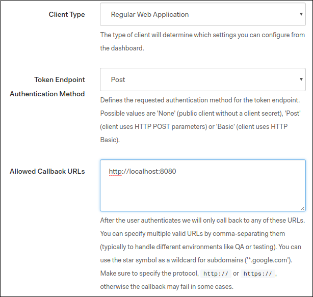

# auth0-authentication

Add Auth0 Authentication to your Graphcool project 🎁


## Getting Started

### 1. Add the template to your Graphcool service

```sh
graphcool add-template graphcool/templates/auth/auth0
```

### 2. Uncomment lines in `graphcool.yml` and `types.graphql`

The [`add-template`](https://docs-next.graph.cool/reference/graphcool-cli/commands-aiteerae6l#graphcool-add-template) command is performing three major steps:

1. Download the source files from the [`src`](./src) directory and put them into your service's `src` directory (into a subdirectory called `auth0`).
2. Download the contents from [`graphcool.yml`](./graphcool.yml) and append them as comments to your service's `graphcool.yml`.
3. Download the contents from [`types.graphql`](./types.graphql) and append them as comments to your service's `types.graphql`.

In order for the changes to take effect, you need to manually uncomment all the lines that have been added by the `add-template` command.

### 3. Setup Auth0 credentials

* Create a new Auth0 account or log-in to your existing one
* Create a new Auth0 client with the following settings


  * Client Type - *Regular Web Application*
  * Token Endpoint Authentication Method - *Post*
  * Allowed Callback URLs - `http://localhost:8080/`
  


  * In Advanced Settings Section - OAuth tab set JWT Signature Algorithm to value *RS256*


  
  * In Advanced Settings Section - Grant Types tab leave only *Implicit* and *Password* grant types enabled


### 4. Deploy the service

*Make sure the `AUTH0_DOMAIN` and `AUTH0_CLIENT_ID` environment variables are properly set before running the command below.*

Finally, you need to install the [node dependencies](./package.json#L2) and apply all the changes you just made by deploying the service:

```sh
npm install
graphcool deploy
```

## Test the Code

### Setting up the test app

* In order to setup Auth0 Lock Widget replace `__AUTH0_DOMAIN__` and `__CLIENT_ID__` in `test/index.js` with the credentials from your client settings.
* Serve the test application locally on port 8080. For example :
```bash
npm i -g http-server
cd test
http-server
```
* Open `http://localhost:8080/` in a browser and authenticate with the Auth0 Widget.
* Copy the mutation displayed on the page.

### Testing the authentication function

Go to the Graphcool Playground:

```sh
graphcool playground
```

Paste the mutation copied from above

You should see that a new user has been created. The returned token can be used to authenticate requests to your Graphcool API as that user. Note that running the mutation again with a new Auth0 token for the same user will not add a new user.


